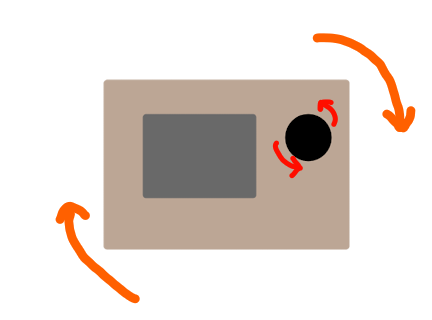
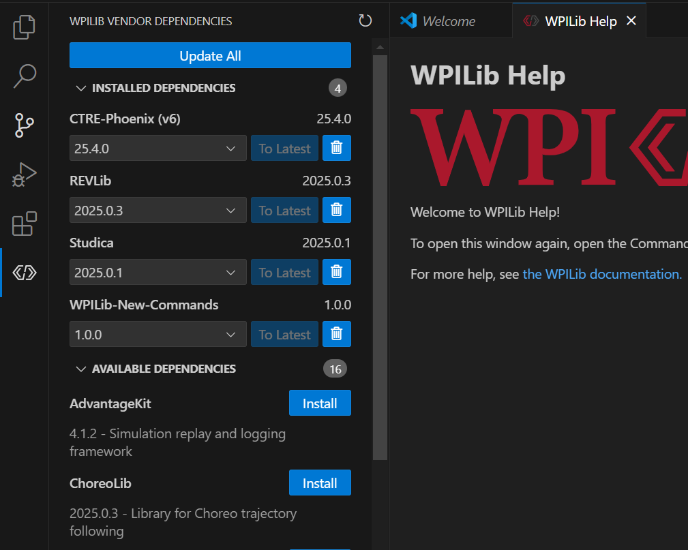

# Sensors and Feedback Lab

In this lab you will configure a motor to always face the direction that it was intialized.

You will use...
- A Neo Motor (`SparkMax` class)
- A Pigeon Gyro (`Pigeon2` class)

After this lab, you should be able to deploy this to the motor board and see your code work!

## Diagram

- Whenever the board turns clockwise, the motor should turn the same amount counterclockwise
    - And vice-versa
- This way the motor will always face the way it was initialized



## Creating a Project

1. Create a new WPILib Java Project
2. Type `Ctrl + Shift + P`
3. Then search for the `WPILib: Create a new project` option
4. Then fill out the boxes accordingly
    - Select a project type: `Template -> java -> Timed Robot`
    - Base Folder: you decide where to put this, since it is your computer
    - Project Name: `NRG948FeedbackLab`
    - Team Number: `0948`
5. Then click generate project

## Importing Vendor Libraries

1. Go to the tab on the side with the WPILib logo
2. Then scroll and install `CTRE-Phoenix` and `REVLib`



3. The other libraries aren't needed

## Creating the variables for the Encoder and Gyro

1. Go to `Robot.java` which is under `src/main/java/frc/robot`
2. Now we're going to create variables:
    - Create and initialize a motor controller variable. Type: `SparkMax`
        - ID: `1`
    - Create a relative encoder variable. Type: `RelativeEncoder`
    - Create and initialize a gyro variable. Type: `Pigeon2`
        - ID: `2`
    - Create a gyro angle variable (which tracks how much the board has rotated). Type: `StatusSignal<Angle>`

3. By the way:
    - The ID for the gyro should be `2`
    - The ID for the motor controller should be `1`

4. As shown below, create another variable for our feedback system 

```java
    PIDController feedbackSystem = new PIDController(0.0001, 0, 0);
    // Note: This variable is our feedback system; we will cover how a PID controller works in the future.
```

5. Now go find the `Robot()` method for the `Robot` class (as shown below)
    - This method will be the first part of the code to run

```java
public Robot() {
    m_chooser.setDefaultOption("Default Auto", kDefaultAuto);
    m_chooser.addOption("My Auto", kCustomAuto);
    SmartDashboard.putData("Auto choices", m_chooser);
  }
```

6. Inside the curly braces go ahead and configure the relative encoder and feedback system
    - First, we're configuring the feedback system (code is provided); just read what it does
    - Next, we're going to initialize the gyro angle variable and relative encoder variable
        - Gyro angle variable should be initialized to `gyro.getYaw()`
        - The value of the motor encoder variable can be found on one of the motor controller's methods
    - After initializing values, set the gyro and the motor encoder to zero degrees

```java
    feedbackSystem.setSetpoint(0.0); // The value the feedback system is trying to get to
    feedbackSystem.setTolerance(0.05); // How many degrees off the system can be and still be fine
    feedbackSystem.enableContinuousInput(0, 360); // Allows it to wrap angles around from 0 degrees to 360 degrees

    // [insert-code-here-to-initialize-gyro-and-encoder]

    // [insert-code-here-to-set-gyro-and-encoder-angle-to-zero]
```

## Calculating the Motor Movement

1. Go to the `robotPeriodic()` method, which is run every 60ms
2. Now to able to seek to a specific angle, we need to know the rotation of the board and angle of the motor
3. So, let's find the values from the relative encoder and gyro **in degrees**, **wrapped to 0º to 360º**
    - Note: [hints for motor angle](hints/EncoderHints.md) and [hints for board rotation](hints/GyroHints.md)

```java
    double currentMotorAngle = // [insert-method-here]
    double currentBoardRotation = // [insert-method-here]
```

4. Calculate the speed the motor should go at, using the feedback system as shown below
    - Write an if statement that sets the speed to `0.0` if the feedbackSystem is at it's goal angle (`atSetpoint()` method)

```java
    double speed = feedbackSystem.calculate(currentMotorAngle, -currentBoardRotation);
    // Tells the feedback system the current motor angle and then tells it rotate the opposite amount of the board's rotation

    // Insert code for setting the speed to zero if at goal angle
```

5. Lastly, limit the speed of the motor from `-0.025 to 0.025` using MathUtil.clamp()
    - Then, **set** that as the speed of the motor controller, using a method on the motor controller

6. Now you're done, build your code and test!
